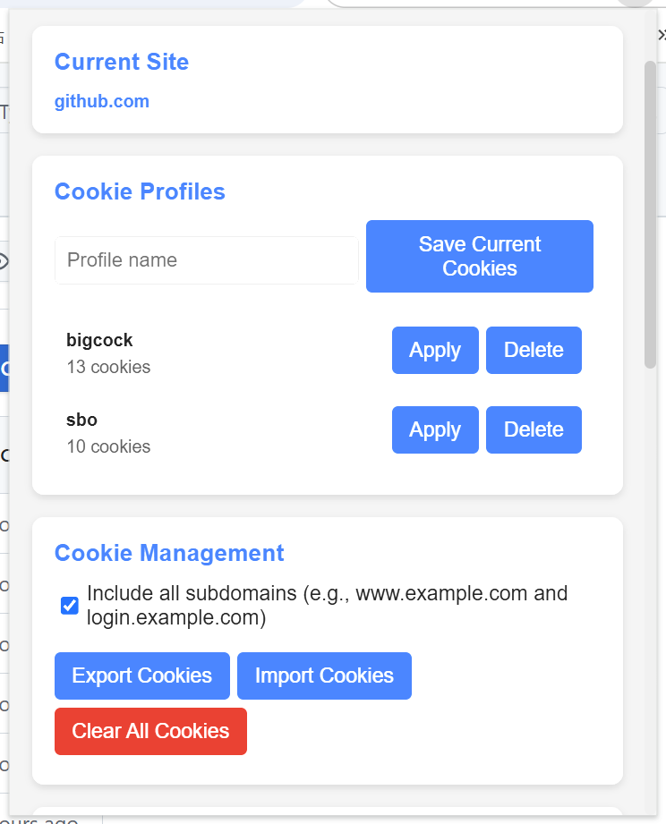
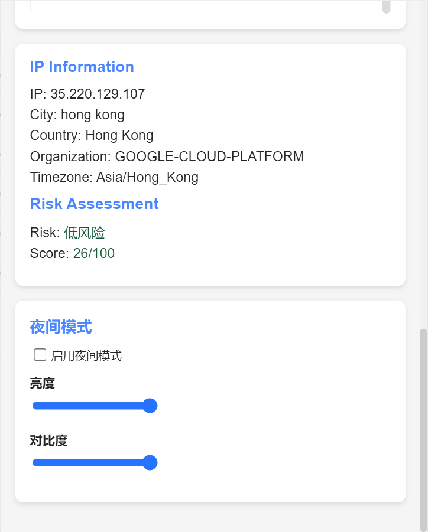

# SwitchCookies

SwitchCookies 是一个浏览器扩展，旨在帮助用户管理不同网站的Cookie设置，快速切换到不同的账号。

## 项目结构

- **manifest.json**: 扩展的配置文件，定义了扩展的基本信息和权限。
- **background.js**: 后台脚本，用于处理扩展的后台逻辑。
- **popup.html**: 扩展的弹出界面，用户可以通过此界面与扩展交互。
- **popup.js**: 弹出界面的逻辑脚本。
- **popup.css**: 弹出界面的样式文件。
- **icons/**: 包含扩展的图标文件。

## 安装

从release中下载crx文件安装

或者克隆本仓库，然后将文件夹添加到Chrome浏览器的扩展管理器中。

## 使用

## 贡献

欢迎提交问题和拉取请求以改进此扩展。
