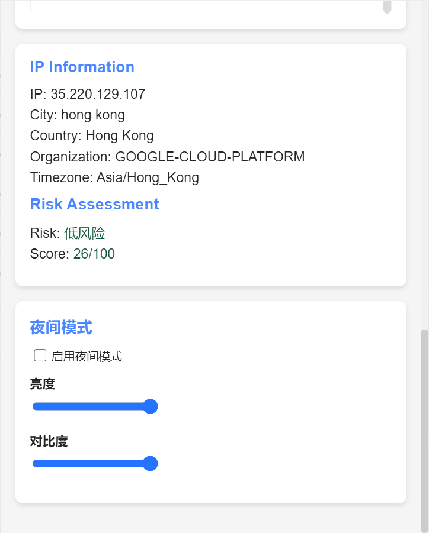

# SwitchCookies

<div align="center">
  
  <h3>Manage and switch between different cookie profiles for websites</h3>
</div>

<p align="center">
  <a href="#key-features">Features</a> •
  <a href="#installation">Installation</a> •
  <a href="#usage">Usage</a> •
  <a href="#configuration">Configuration</a> •
  <a href="#development">Development</a> •
  <a href="#contributing">Contributing</a> •
  <a href="#license">License</a> •
  <a href="#faq">FAQ</a>
</p>

<p align="center">
  <a href="#中文说明">中文</a> | <a href="#english">English</a>
</p>

---

## English

SwitchCookies is a Chrome extension designed to help users manage cookie settings for different websites and quickly switch between different accounts. It provides a convenient way to save, edit, and apply cookie profiles, making it easy to switch between multiple accounts on the same website without the hassle of logging in and out.

## Key Features

- **Cookie Profile Management**: Save, load, and switch between different cookie profiles for websites
- **Individual Cookie Editing**: Edit properties of individual cookies directly from the extension
- **Subdomain Support**: Get and clear cookies from all subdomains of a website
- **Cookie Search**: Search and filter cookies with fuzzy search and autocomplete
- **One-Click Clearing**: Clear all cookies for the current website with confirmation
- **Export/Import**: Export and import cookie profiles as JSON files
- **Auto-Refresh**: Automatically refresh the page after applying cookies
- **Night Mode**: Dark theme support with customizable brightness and contrast
- **Multilingual Support**: Available in English and Chinese
- **Security Features**: IP information and risk assessment

## Screenshots

<div align="center">
  
  
</div>

## Installation

### Method 1: Chrome Web Store (Coming Soon)
- The extension will be available on the Chrome Web Store in the future

### Method 2: Manual Installation
1. Download this repository as a ZIP file or clone it
2. Extract the ZIP file to a folder on your computer
3. Open Chrome and navigate to `chrome://extensions/`
4. Enable "Developer mode" in the top-right corner
5. Click "Load unpacked" and select the extracted folder
6. The extension should now be installed and visible in your browser toolbar

## Usage

### Basic Usage
1. Click on the SwitchCookies icon in your browser toolbar to open the extension
2. The extension will display the current website and its cookies
3. To save the current cookies as a profile:
   - Enter a name in the "Profile name" field
   - Click "Save Current Cookies"
4. To apply a saved profile:
   - Find the profile in the list
   - Click "Apply" to load those cookies
   - The page will automatically refresh

### Cookie Management
- **View Cookies**: All cookies for the current website are displayed in the "Current Cookies" section
- **Search Cookies**: Use the search box to find specific cookies by name, value, or domain
- **Edit Cookies**: Click the edit icon next to a cookie to modify its properties
- **Export Cookies**: Click "Export Cookies" to save the current website's cookies as a JSON file
- **Import Cookies**: Click "Import Cookies" to load cookies from a previously exported JSON file
- **Clear Cookies**: Click "Clear All Cookies" to remove all cookies for the current website

### Advanced Features
- **Include Subdomains**: Toggle the "Include all subdomains" checkbox to include or exclude cookies from subdomains
- **Export All Cookies**: Use the "Export All Cookies" button to export all browser cookies (use with caution)
- **Night Mode**: Toggle night mode and adjust brightness/contrast in the Night Mode section
- **Language**: Switch between English and Chinese using the language selector

## Configuration

### Extension Settings
All settings are automatically saved and persisted between browser sessions:

- **Language Preference**: The extension remembers your selected language
- **Night Mode Settings**: Night mode state, brightness, and contrast are saved
- **Subdomain Inclusion**: Your preference for including subdomains is remembered
- **Cookie Profiles**: All saved cookie profiles are stored locally

### Cookie Profiles
Cookie profiles are stored in your browser's local storage and include:
- Domain information
- All cookies associated with the domain
- Whether subdomains are included
- Creation timestamp

## Development

### Project Structure
- **manifest.json**: Extension configuration file defining basic information and permissions
- **background.js**: Background script for handling extension logic
- **popup.html**: Popup interface for user interaction
- **popup.js**: Logic script for the popup interface
- **popup.css**: Style file for the popup interface
- **icons/**: Contains extension icon files
- **images/**: Contains screenshots for documentation

### Building from Source
1. Clone the repository:
   ```
   git clone https://github.com/yourusername/SwitchCookies.git
   cd SwitchCookies
   ```

2. Install dependencies:
   ```
   npm install
   ```

3. Build the extension:
   ```
   npm run build
   ```

4. The built extension will be in the `dist` directory

### Creating a Release
The project includes a GitHub workflow that automatically builds and packages the extension when a new tag is pushed:

1. Create a new tag:
   ```
   git tag v1.x.x
   git push origin v1.x.x
   ```

2. The workflow will create a release with the packaged extension

## Testing

### Manual Testing
1. Load the extension in Chrome using Developer mode
2. Test all features on different websites
3. Verify that cookie profiles are correctly saved and applied
4. Check that the extension works with various cookie configurations

### Reporting Issues
If you encounter any bugs or issues, please report them on the GitHub issue tracker with:
- A clear description of the problem
- Steps to reproduce the issue
- Expected vs. actual behavior
- Browser version and operating system

## Contributing

Contributions are welcome! Here's how you can contribute:

1. Fork the repository
2. Create a feature branch: `git checkout -b feature/amazing-feature`
3. Commit your changes: `git commit -m 'Add some amazing feature'`
4. Push to the branch: `git push origin feature/amazing-feature`
5. Open a Pull Request

Please make sure your code follows the existing style and includes appropriate documentation.

## License

This project is licensed under the Apache License 2.0 - see the LICENSE file for details.

## FAQ

### Q: Is it safe to use this extension?
A: The extension only accesses cookies for the websites you visit and stores data locally in your browser. It does not send your cookies to any external servers. However, be cautious when exporting cookies, as they may contain sensitive information.

### Q: Can I use this extension to log into multiple accounts simultaneously?
A: No, this extension helps you switch between accounts, but you can only be logged into one account per website at a time in the same browser window. Use different browser profiles for simultaneous logins.

### Q: Will my saved profiles work across different computers?
A: No, cookie profiles are saved in your browser's local storage and are not synchronized across devices. You can manually export profiles and import them on another computer.

### Q: Does this work with all websites?
A: The extension should work with most websites, but some websites with advanced security measures may detect cookie modifications and log you out.

### Q: Can I edit cookies for any website?
A: You can only view and edit cookies for the website you're currently visiting, as restricted by browser security policies.

---

## 中文说明

SwitchCookies 是一个浏览器扩展，旨在帮助用户管理不同网站的Cookie设置，快速切换到不同的账号。它提供了一种便捷的方式来保存、编辑和应用Cookie配置，使您可以在同一网站上轻松切换多个账号，而无需频繁登录和退出。

## 主要功能

- **Cookie配置管理**：保存、加载和切换网站的不同Cookie配置
- **单个Cookie编辑**：直接从扩展中编辑单个Cookie的属性
- **子域名支持**：获取和清除网站所有子域名的Cookie
- **Cookie搜索**：使用模糊搜索和自动完成功能搜索和过滤Cookie
- **一键清除**：一键清除当前网站的所有Cookie（带确认提示）
- **导出/导入**：将Cookie配置导出为JSON文件或从JSON文件导入
- **自动刷新**：应用Cookie后自动刷新页面
- **夜间模式**：深色主题支持，可自定义亮度和对比度
- **多语言支持**：支持英文和中文
- **安全功能**：IP信息和风险评估

## 截图

<div align="center">
  
  
</div>

## 安装

### 方法1：Chrome网上应用店（即将推出）
- 该扩展将来会在Chrome网上应用店提供

### 方法2：手动安装
1. 下载本仓库的ZIP文件或克隆仓库
2. 将ZIP文件解压到计算机上的文件夹中
3. 打开Chrome并导航至`chrome://extensions/`
4. 在右上角启用"开发者模式"
5. 点击"加载已解压的扩展程序"并选择解压后的文件夹
6. 扩展现在应该已安装并在浏览器工具栏中可见

## 使用方法

### 基本使用
1. 点击浏览器工具栏中的SwitchCookies图标打开扩展
2. 扩展将显示当前网站及其Cookie
3. 要将当前Cookie保存为配置：
   - 在"配置名称"字段中输入名称
   - 点击"保存当前Cookies"
4. 要应用已保存的配置：
   - 在列表中找到该配置
   - 点击"应用"加载这些Cookie
   - 页面将自动刷新

### Cookie管理
- **查看Cookie**：当前网站的所有Cookie都显示在"当前Cookies"部分
- **搜索Cookie**：使用搜索框按名称、值或域名查找特定Cookie
- **编辑Cookie**：点击Cookie旁边的编辑图标修改其属性
- **导出Cookie**：点击"导出Cookies"将当前网站的Cookie保存为JSON文件
- **导入Cookie**：点击"导入Cookies"从之前导出的JSON文件加载Cookie
- **清除Cookie**：点击"清除所有Cookies"删除当前网站的所有Cookie

### 高级功能
- **包含子域名**：切换"包含所有子域名"复选框以包含或排除子域名的Cookie
- **导出所有Cookie**：使用"导出所有Cookies"按钮导出所有浏览器Cookie（谨慎使用）
- **夜间模式**：在夜间模式部分切换夜间模式并调整亮度/对比度
- **语言**：使用语言选择器在英文和中文之间切换

## 配置

### 扩展设置
所有设置都会自动保存并在浏览器会话之间保持：

- **语言偏好**：扩展会记住您选择的语言
- **夜间模式设置**：夜间模式状态、亮度和对比度会被保存
- **子域名包含**：您对包含子域名的偏好会被记住
- **Cookie配置**：所有保存的Cookie配置都存储在本地

### Cookie配置
Cookie配置存储在浏览器的本地存储中，包括：
- 域名信息
- 与域名关联的所有Cookie
- 是否包含子域名
- 创建时间戳

## 开发

### 项目结构
- **manifest.json**：扩展配置文件，定义基本信息和权限
- **background.js**：后台脚本，处理扩展逻辑
- **popup.html**：弹出界面，用于用户交互
- **popup.js**：弹出界面的逻辑脚本
- **popup.css**：弹出界面的样式文件
- **icons/**：包含扩展图标文件
- **images/**：包含文档和说明的截图

### 从源代码构建
1. 克隆仓库：
   ```
   git clone https://github.com/yourusername/SwitchCookies.git
   cd SwitchCookies
   ```

2. 安装依赖：
   ```
   npm install
   ```

3. 构建扩展：
   ```
   npm run build
   ```

4. 构建好的扩展将位于`dist`目录中

### 创建发布版本
该项目包含一个GitHub工作流，当推送新标签时会自动构建和打包扩展：

1. 创建新标签：
   ```
   git tag v1.x.x
   git push origin v1.x.x
   ```

2. 工作流将创建一个包含打包扩展的发布版本

## 测试

### 手动测试
1. 使用开发者模式在Chrome中加载扩展
2. 在不同网站上测试所有功能
3. 验证Cookie配置是否正确保存和应用
4. 检查扩展是否适用于各种Cookie配置

### 报告问题
如果您遇到任何错误或问题，请在GitHub问题跟踪器上报告，包括：
- 问题的清晰描述
- 重现问题的步骤
- 预期行为与实际行为
- 浏览器版本和操作系统

## 贡献

欢迎贡献！以下是您可以贡献的方式：

1. Fork仓库
2. 创建功能分支：`git checkout -b feature/amazing-feature`
3. 提交您的更改：`git commit -m '添加一些惊人的功能'`
4. 推送到分支：`git push origin feature/amazing-feature`
5. 打开Pull Request

请确保您的代码遵循现有风格并包含适当的文档。

## 许可证

本项目采用Apache License 2.0许可 - 有关详细信息，请参阅LICENSE文件。

## 常见问题

### 问：使用这个扩展安全吗？
答：该扩展只访问您访问的网站的Cookie，并将数据存储在浏览器本地。它不会将您的Cookie发送到任何外部服务器。但是，导出Cookie时要谨慎，因为它们可能包含敏感信息。

### 问：我可以使用这个扩展同时登录多个账号吗？
答：不可以，这个扩展帮助您切换账号，但在同一浏览器窗口中，每个网站一次只能登录一个账号。使用不同的浏览器配置文件进行同时登录。

### 问：我保存的配置在不同计算机上有效吗？
答：不会，Cookie配置保存在浏览器的本地存储中，不会在设备之间同步。您可以手动导出配置并在另一台计算机上导入。

### 问：这对所有网站都有效吗？
答：该扩展应该适用于大多数网站，但一些具有高级安全措施的网站可能会检测到Cookie修改并将您登出。

### 问：我可以编辑任何网站的Cookie吗？
答：由于浏览器安全策略的限制，您只能查看和编辑当前正在访问的网站的Cookie。
