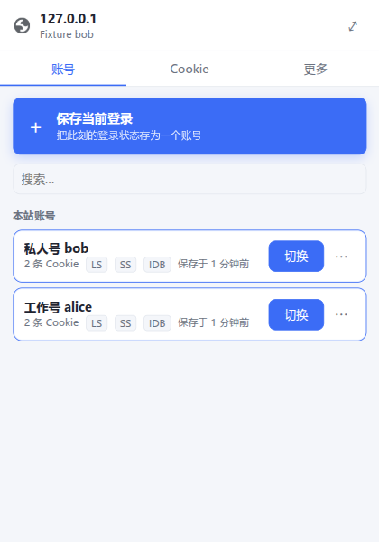
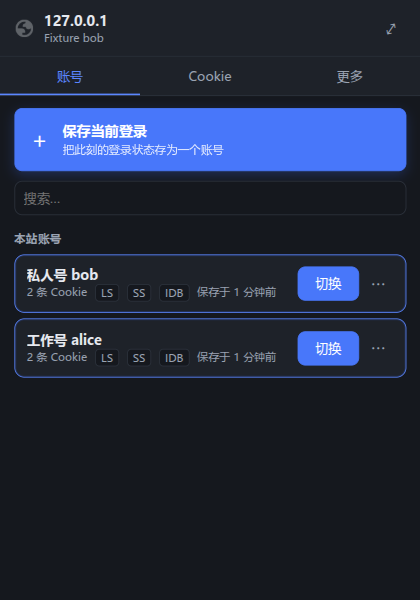
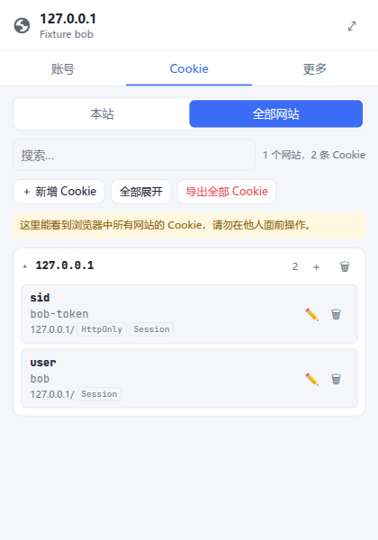

# SwitchCookies

<div align="center">
  
  <h3>一键保存并切换网站登录状态</h3>
  <p>Cookie · localStorage · sessionStorage · IndexedDB</p>
</div>

<p align="center"><a href="#中文">中文</a> | <a href="#english">English</a></p>

---

## 中文

### 它解决什么问题

同一个网站有多个账号（工作号 / 私人号 / 测试号），来回退出登录很烦。SwitchCookies 把"此刻的登录状态"整体存成一个**账号**，之后一键切换，页面自动刷新。

比喻：Cookie 是网站发给你的**会员卡**，localStorage / IndexedDB 是网站寄放在你浏览器里的**储物柜**。有的网站把登录态写在卡上，有的写在柜子里，本扩展两样都会一起搬走、一起换回来。

### 截图

<p align="center">
  
  
  
</p>

### 三步上手

1. 在网站登录账号 A → 点扩展图标 → **保存当前登录**（名字已自动填好，回车即可）
2. 退出，登录账号 B → 再保存一次
3. 之后点账号旁的 **切换**，或在网页上**右键 → SwitchCookies → 账号名**，秒换

### 功能一览

| 标签页 | 内容 |
|---|---|
| **账号** | 本站账号置顶高亮；一键切换；⋯ 菜单里可覆盖 / 重命名 / 导出 / 删除（删除后 5 秒内可撤销） |
| **Cookie** | 「本站」平铺可编辑；「全部网站」按域名分组折叠，可搜索、新增、编辑、删单条或整个域名 |
| **更多** | 导入 / 导出（账号文件、单站 Cookie、全部 Cookie 三种格式互认）；WebDAV 备份；手动查询出口 IP；主题（跟随系统 / 浅色 / 深色）；语言；存储用量 |
| **右键菜单** | 网页任意处右键 → SwitchCookies → 直接列出本站账号，不用打开面板 |

### 安装

Chrome 119+。

1. 从 [Releases](https://github.com/clionertr/SwitchCookies/releases) 下载 zip 并解压（或直接 clone 本仓库）
2. 打开 `chrome://extensions/`，右上角开启 **开发者模式**
3. 点 **加载已解压的扩展程序**，选择解压后的文件夹

### 保存了什么、存在哪

每个账号包含：域名、是否含子域名、全部 Cookie（含 CHIPS 分区 Cookie）、可选的 localStorage / sessionStorage / IndexedDB 快照、时间戳。全部保存在 `chrome.storage.local`（本机），不上传任何服务器。已声明 `unlimitedStorage`，不受 10 MB 配额限制；写入失败会明确报错，不会"假成功"。

### 已知边界

- **IndexedDB 写回**：若页面在切换瞬间仍持有数据库连接，该库会被跳过并提示"被页面占用"，刷新后再切一次即可。含 `Blob` / `File` 的记录无法序列化，会被跳过。
- **sharedStorage**：浏览器有意对扩展隔离，无 API 可读，不支持。
- **超大数据**：单条 localStorage 值 > 512 KB、单个 IndexedDB 库序列化后 > 20 MB 会被跳过，保存成功提示里会注明跳过数量。
- **公共后缀**：`github.io`、`vercel.app` 这类平台域名会被当成一个站，请关闭"包含子域名"。
- **WebDAV 密码**明文保存在本机 `chrome.storage.local`。

### 开发

零构建：原生 ES Module，无 `npm install`。

```
manifest.json          MV3，Service Worker 为 module
background.js          右键菜单、在标签页打开
popup.html / popup.css 界面与 CSS 变量主题
src/lib/               纯逻辑库（无 DOM 依赖，后台与弹窗共用）
  domain.js            域名 / 根域名 / 公共后缀
  cookies.js           Cookie 读写（CHIPS、__Host- 前缀、hostOnly）
  storage.js           账号与设置持久化（写入失败必抛错）
  pageStorage.js       注入页面抓取 / 写回 LS / SS / IndexedDB
  i18n.js theme.js webdav.js ipinfo.js ui.js
src/popup/             视图层
  main.js context.js profilesView.js cookiesView.js cookieEditor.js moreView.js
```

发布：改 `manifest.json` 的 `version`，打 tag `vX.Y.Z` 推送，GitHub Actions 自动打 zip 并发 Release。

### 许可

Apache License 2.0

---

## English

### What it does

Multiple accounts on the same site (work / personal / test)? Logging in and out is a chore. SwitchCookies snapshots the *current login state* as an **account** and lets you switch back with one click; the page reloads automatically.

Analogy: cookies are the **membership card** a site hands you; localStorage / IndexedDB are the **lockers** the site keeps in your browser. Some sites put the login on the card, some in the locker. This extension moves both together.

### Screenshots

See the images in the Chinese section above (accounts tab light / dark, cookies tab grouped by domain).

### Three steps

1. Log in as account A → click the icon → **Save current login** (name is pre-filled, just press Enter)
2. Log out, log in as B → save again
3. Click **Switch** next to an account, or **right-click the page → SwitchCookies → account name**

### Features

| Tab | Contents |
|---|---|
| **Accounts** | Accounts for the current site pinned on top; one-click switch; ⋯ menu for overwrite / rename / export / delete (undo within 5 s) |
| **Cookies** | "This site": flat, editable list. "All sites": grouped by domain, searchable, add / edit / delete single cookies or whole domains |
| **More** | Import / export (account files, single-site cookies, all cookies — all three formats recognised); WebDAV backup; manual public-IP lookup; theme (system / light / dark); language; storage usage |
| **Context menu** | Right-click any page → SwitchCookies → accounts for this site, no panel needed |

### Install

Chrome 119+.

1. Download the zip from [Releases](https://github.com/clionertr/SwitchCookies/releases) and unzip (or clone the repo)
2. Open `chrome://extensions/`, enable **Developer mode**
3. **Load unpacked**, pick the folder

### What is stored, and where

Each account: domain, subdomain flag, all cookies (including CHIPS partitioned cookies), optional localStorage / sessionStorage / IndexedDB snapshot, timestamps. Everything lives in `chrome.storage.local` on your machine; nothing is uploaded. `unlimitedStorage` is declared, so the 10 MB quota does not apply, and any write failure is reported loudly — no silent "saved".

### Known limits

- **IndexedDB restore**: if the page still holds a database connection at the moment of switching, that database is skipped with an "in use" notice — reload and switch again. Records containing `Blob` / `File` cannot be serialised and are skipped.
- **sharedStorage**: deliberately isolated from extensions by the browser; no API exists. Not supported.
- **Large values**: a single localStorage entry > 512 KB or an IndexedDB database > 20 MB serialised is skipped; the success toast reports how many were skipped.
- **Public suffixes**: platform domains like `github.io` / `vercel.app` are treated as one site — disable "Include subdomains" there.
- **WebDAV password** is stored in plain text in `chrome.storage.local`.

### Development

Zero build: native ES Modules, no `npm install`. See the directory map in the Chinese section above.

Release: bump `version` in `manifest.json`, push tag `vX.Y.Z`; GitHub Actions zips and publishes a Release.

### License

Apache License 2.0